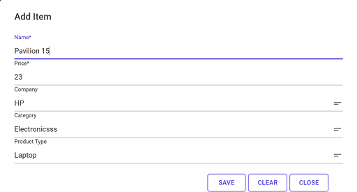

# ProductCatalog Solution
This repository hosts a C# solution for managing and interacting with a product catalog. It includes a core library, database migrations, automated tests, and two distinct user interfaces: WinForms and MudBlazor. Authentication is handled via login and BCrypt-hashed passwords to ensure secure access control.

User authentication is performed via login and password. Passwords are stored as BCrypt hashes. During sign-in, the entered password is hashed and compared against the stored hash to validate credentials.

## The solution structure comprises five projects:
- ProductCatalog.Core;
- ProductCatalog.Migrations;
- ProductCatalog.Test;
- ProductCatalog.WinForms (UI);
- ProductCatalog.MudBlazors (UI);

## 🔐 Functionality
### Authentication
- Login and password authorization;
- Password hashing using BCrypt;
- Secure endpoints;

### Data management
- Company - Company management;
- Category - Product categories;
- Type - Category subtypes;
- Product - Products with binding to types;

### Import/Export (.xlsx file):
- Export select one or more tables;
- Import data from files for one or more selected tables;
- Validate file structure wheb importing:
    * Sheet names must match DB table names;
    * Row 1 headers must match table fields;
    * Data types checked per row.

## Blazor

  

  

  

## WinForms

  

  

  

## 📦 Technologies
- Entity Framework Core 9 - ORM for working with a database;
- SQLite - Built-in database;
- BCrypt - Password hashing;
- MaterialSkin/MudBlazor - UI components;
- NPOI - Working with Excel files;
- JWT - Authentication in a Web application;
